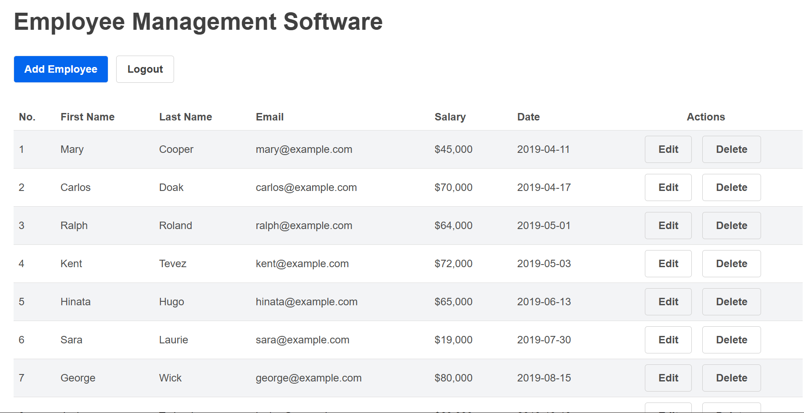

# 🧾 Employee Management CRUD App

A modern React-based **Employee Management System** that allows you to **Create**, **Read**, **Update**, and **Delete** employee records.  
This project is an improved version of an open-source React CRUD app

---



## 🚀 Features

- Add, edit, and delete employee data
- Data persistence using `localStorage`
- Built with React functional components and hooks
- Fully styled with **Tailwind CSS**

## 🧩 Improvements Made

- Replaced all inline and CSS styles with **Tailwind CSS** utility classes.
- Optimized state management with **LocalStorage initializer** inside `useState` for faster load.
- Standardized all SweetAlert2 prompts for consistent user feedback.
- Refactored components for better readability and organization.
- Clearer and more consistent variable naming.
- Removed redundant wrappers and simplified logic for easier maintenance.

## Technologies Used

- [React](http://reactjs.org)
- [Tailwind CSS](https://tailwindcss.com/)
- [SweetAlert2](https://sweetalert2.github.io)

## ⚙️ Installation & Setup

```bash
# 1️⃣ Clone the repository
git clone https://github.com/edosao/CRUD-app.git

# 2️⃣ Navigate into the project directory
cd CRUD-app

# 3️⃣ Install dependencies
npm install

# 4️⃣ Start the development server
npm run dev
```

## Acknowledgment

This project was inspired by an open-source React CRUD app on GitHub.
Credit goes to the original creator for the core structure and logic.

🔗 Original Project: [crud-app](https://github.com/SafdarJamal/crud-app)

### 👨‍💻 Author

[Edosa Ogbevoen](https://github.com/edosao) .
